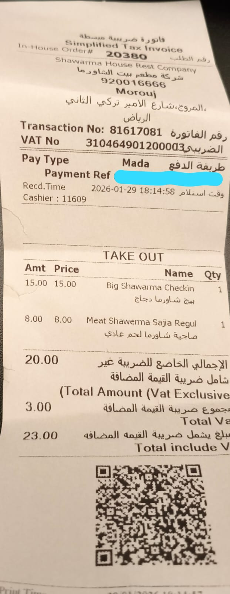

# Garbage In, Garbage Out {.sdaia-dark background-gradient="linear-gradient(135deg, #1C355E, #FF7A5C)"}

From creative writing to data processing

## The Reality {auto-animate=true}

::: {data-id="reality" style="background: #f7f9fc; padding: 1.5em; border-radius: 12px; text-align: center; font-size: 1.2em;"}
Sessions 1–4 focused on **creative & strategic** tasks.
:::

. . .

But **80% of your work** isn't creative. It's **processing**.

::: {.fragment .fade-in}
::: {.incremental}
- Agendas → Minutes
- Invoices → Spreadsheets
- Field Notes → Reports
:::
:::

## The "Chatty Intern" Problem {auto-animate=true}

::: {data-id="reality" style="background: #f7f9fc; padding: 1.2em; border-radius: 12px; border-left: 4px solid #FF7A5C;"}
**You:** "Here are some notes, make them look nice."

**AI:** "Sure! Here is a lovely summary..."
:::

. . .

::: {.fragment .fade-in}
→ Misses 3 key dates, hallucinates a budget item, formats it as a poem.
:::

## The Copy-Paste Loop

::: {style="background: #1C355E; color: #ffffff; padding: 1.5em; border-radius: 12px; text-align: center; font-size: 1.1em;"}
5 seconds pasting the data.

10 minutes fixing the AI's mistakes.
:::

. . .

If you have to check every single line, **the AI is not saving you time.**

# The SOP {.sdaia-dark background-gradient="linear-gradient(135deg, #1C355E, #00C9A7)"}

Standard Operating Procedure

## The Mindset Shift {auto-animate=true}

:::: {.columns}
::: {.column width="50%"}
::: {.fragment .fade-in}
::: {style="background: #f7f9fc; padding: 1em; border-radius: 12px; border-left: 4px solid #FF7A5C;"}
**Before**

Treat AI like a **person**

"Make this look nice"
:::
:::
:::
::: {.column width="50%"}
::: {.fragment .fade-in}
::: {style="background: #f7f9fc; padding: 1em; border-radius: 12px; border-left: 4px solid #00C9A7;"}
**After**

Treat AI like a **machine**

Give it an SOP in Markdown
:::
:::
:::
::::

## The Assembly Line {auto-animate=true}

::: {.fragment .fade-in-then-semi-out}
::: {style="background: #f7f9fc; padding: 0.8em; border-radius: 12px; text-align: center; margin-bottom: 0.5em;"}
**1. Input Conveyor Belt**

Raw, messy data — emails, PDFs, WhatsApp voice notes
:::
:::

::: {.fragment .fade-in-then-semi-out}
::: {style="background: #1C355E; color: #ffffff; padding: 0.8em; border-radius: 12px; text-align: center; margin-bottom: 0.5em;"}
**2. The SOP (The Machine)**

A strict set of rules that processes the data
:::
:::

::: {.fragment .fade-in}
::: {style="background: #f7f9fc; padding: 0.8em; border-radius: 12px; text-align: center;"}
**3. Output Conveyor Belt**

Clean, structured data — tables, CSVs, reports
:::
:::

# Real-World Scenario {.sdaia-dark background-gradient="linear-gradient(135deg, #FF7A5C, #1C355E)"}

The "Expense Report" Nightmare

## The Setup

You're a consultant working between **Riyadh** and **Jeddah**. End of month.

Finance and ZATCA are strict. You have **3 chaotic inputs** that need to become one clean Excel table.

. . .

::: {style="text-align: center; font-size: 1.2em; color: #FF7A5C; font-weight: bold;"}
3 formats. 1 table. Zero tolerance for error.
:::

## Input 1: The Crumpled Receipt {auto-animate=true}

::: {data-id="inputs"}
{height="450" fig-align="center"}
:::

## Input 2: The Forwarded Email {auto-animate=true}

::: {data-id="inputs" style="font-size: 0.85em;"}
3 chaotic inputs:
:::

::: {style="background: #f7f9fc; padding: 1em; border-radius: 12px; font-size: 0.85em;"}
**From:** Flynas Reservations

**Subject:** Confirmation XY782

Flight XY782: RUH to JED | Seat: 4A (Business)

**Price: SAR 1,250.00** | Date: Oct 26th
:::

## Input 3: The WhatsApp Voice Note {auto-animate=true}

::: {data-id="inputs" style="font-size: 0.85em;"}
3 chaotic inputs:
:::

::: {style="background: #f7f9fc; padding: 1em; border-radius: 12px; font-style: italic; font-size: 0.85em;"}
"Hey, forgot to log the transport. Taken a Careem from the hotel to the Ministry at 9 AM, that was 45 Riyals. Then an Uber to the airport, 105 Riyals. Oh, and I bought a coffee at the airport for 25 Riyals. All on the 26th."
:::

# Activity: Build the SOP {.sdaia-dark background-gradient="linear-gradient(135deg, #1C355E, #9B8EC0)"}

Turn chaos into structure

## The Bad Prompt {auto-animate=true}

::: {data-id="prompt" style="background: #f7f9fc; padding: 1.2em; border-radius: 12px; border-left: 4px solid #FF7A5C;"}
"Here are my receipts, please make a table."
:::

. . .

→ Vague instructions = unreliable output. Every. Single. Time.

## The SOP Prompt {auto-animate=true}

::: {data-id="prompt" style="background: #f7f9fc; padding: 1em; border-radius: 12px; border-left: 4px solid #00C9A7; font-size: 0.75em;"}
**Role:** You are a Senior Accountant for a Saudi consulting firm.

**Goal:** Process raw expense data into a strict financial log.

**Input Data:** [PASTE THE 3 INPUTS]

**SOP (Standard Operating Procedure):**

1. **Scan** the text for financial transactions
2. **Categorize** each item: [Meals], [Travel], [Transport], [Office Supplies]
3. **Standardize** dates to YYYY-MM-DD format
4. **Convert** all currencies to SAR (if needed)
5. **Output** ONLY a Markdown table with these exact headers:

| Date | Vendor | Category | Amount (SAR) | VAT (15%) | Notes |

**Constraints:**

- If VAT not visible, assume included (Gross / 1.15 = Net)
- If vendor unknown, write "Cash Expense"
- Do not chat. Just output the table.
:::

## Anatomy of the SOP

:::: {.columns}
::: {.column width="50%"}
::: {.fragment .fade-in}
::: {style="background: #f7f9fc; padding: 0.8em; border-radius: 12px; border-left: 4px solid #00C9A7; margin-bottom: 0.5em;"}
**Steps 1–2: Extract & Classify**

Scan for transactions, tag each one
:::
:::

::: {.fragment .fade-in}
::: {style="background: #f7f9fc; padding: 0.8em; border-radius: 12px; border-left: 4px solid #00C9A7;"}
**Steps 3–4: Standardize**

Dates → YYYY-MM-DD, Currency → SAR
:::
:::
:::
::: {.column width="50%"}
::: {.fragment .fade-in}
::: {style="background: #f7f9fc; padding: 0.8em; border-radius: 12px; border-left: 4px solid #00C9A7; margin-bottom: 0.5em;"}
**Step 5: Output**

Exact headers, exact format — no creativity
:::
:::

::: {.fragment .fade-in}
::: {style="background: #f7f9fc; padding: 0.8em; border-radius: 12px; border-left: 4px solid #9B8EC0;"}
**Constraints: Edge Cases**

Missing VAT? Unknown vendor? Handle it.
:::
:::
:::
::::

# The Output {.sdaia-dark background-gradient="linear-gradient(135deg, #1C355E, #00C9A7)"}

Structured data from chaos

## The Result

| Date | Vendor | Category | Amount (SAR) | VAT (15%) | Notes |
| :--- | :--- | :--- | :--- | :--- | :--- |
| 2026-01-29 | Shawarma House | Meals | 23.00 | 3.00 | Shawarma Chicken & Meat |
| 2025-10-26 | Flynas | Travel | 1,250.00 | 163.04 | Flight RUH-JED |
| 2025-10-26 | Careem | Transport | 45.00 | 5.87 | Hotel to Ministry |
| 2025-10-26 | Uber | Transport | 105.00 | 13.70 | Ministry to Airport |
| 2025-10-26 | Airport Cafe | Meals | 25.00 | 3.26 | Coffee |

## Why This Matters {auto-animate=true}

::: {data-id="why"}
This isn't just a table. It's **Structured Data**.
:::

. . .

::: {.callout-important}
## The Principle
You cannot analyze chaos. You can only analyze **structure**.
:::

## The Bridge to Session 6 {auto-animate=true}

::: {data-id="why"}
With structured data, you can now ask:
:::

::: {.fragment .fade-in}
::: {style="background: #f7f9fc; padding: 0.8em; border-radius: 12px; border-left: 4px solid #00C9A7; margin-bottom: 0.5em;"}
"Analyze my **travel spend vs. meals** for Q4."
:::
:::

::: {.fragment .fade-in}
::: {style="background: #f7f9fc; padding: 0.8em; border-radius: 12px; border-left: 4px solid #9B8EC0;"}
"**Visualize** this data as a bar chart."
:::
:::

. . .

::: {style="text-align: center; font-size: 1.1em;"}
Session 5 builds the **data**. Session 6 builds the **insight**.
:::

# Micro-Check {.sdaia-dark background-gradient="linear-gradient(135deg, #1C355E, #9B8EC0)"}

Debug the SOP

## Quiz

Your SOP keeps **failing to capture the VAT Number** from receipts. What do you add?

. . .

:::: {.columns}
::: {.column width="33%"}
::: {.fragment .fade-in}
::: {style="background: #f7f9fc; padding: 0.8em; border-radius: 12px; text-align: center;"}
1) "Please try harder"

❌
:::
:::
:::
::: {.column width="33%"}
::: {.fragment .fade-in}
::: {style="background: #f7f9fc; padding: 0.8em; border-radius: 12px; text-align: center;"}
2) "I will be sad if you miss it"

❌
:::
:::
:::
::: {.column width="33%"}
::: {.fragment .fade-in}
::: {style="background: #00C9A7; color: white; padding: 0.8em; border-radius: 12px; text-align: center;"}
3) Add a specific SOP step

✅
:::
:::
:::
::::

. . .

::: {style="background: #f7f9fc; padding: 0.8em; border-radius: 12px; border-left: 4px solid #00C9A7; font-size: 0.9em;"}
*"Look for text starting with 'VAT' or 'Tax ID' and extract the 15-digit code."*

If the machine fails, **update the code** (the SOP).
:::

## Key Takeaways {.sdaia-dark background-color="#1C355E"}

::: {.incremental}
1. **80% of work is processing** — not creative, just structured
2. **SOP > conversation** — treat AI like a machine, not a person
3. **Assembly line logic** — Input → SOP → Structured output
4. **Be specific on edge cases** — missing VAT, unknown vendors
5. **Structure enables analysis** — clean data now, insights next
:::
