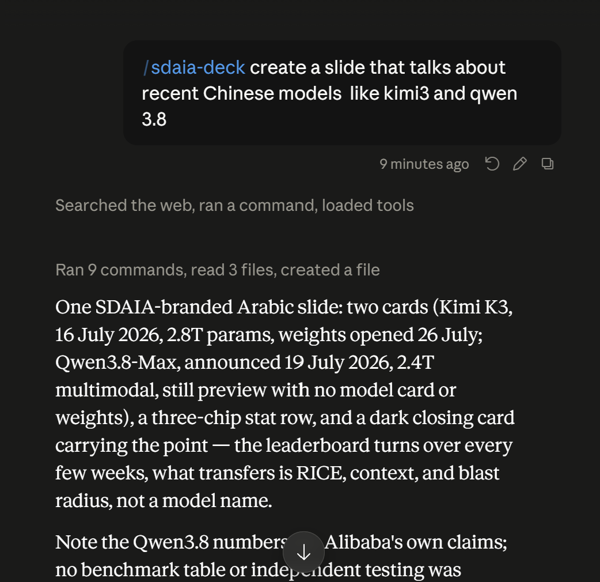
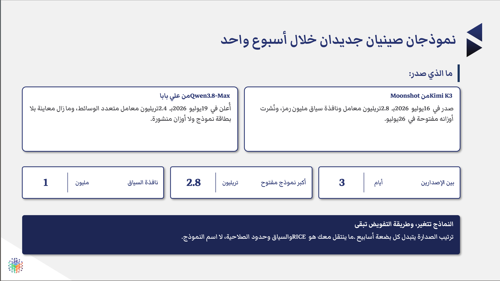
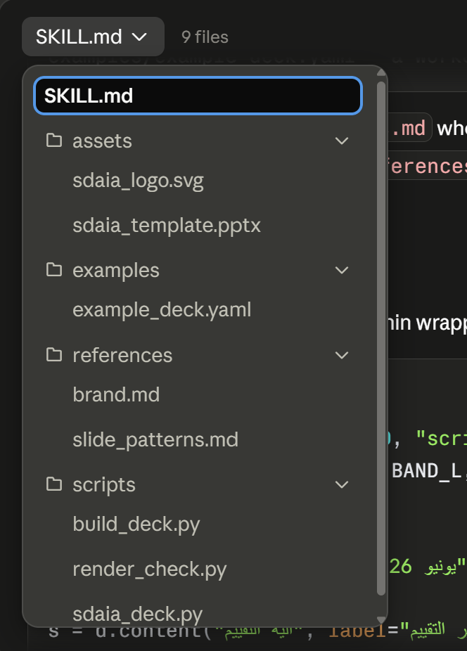

# المهارات {.sdaia-dark background-gradient="linear-gradient(135deg, #1C355E, #FF7A5C)"}

لتستغني عن تكرار شرح المهمة ذاتها

## ما هي المهارة (Skill) {auto-animate=true}

::: {.card .accent-orange data-id="anatomy"}
مهاراتك **مكتبة منظمّة**، وكل مهارة **كتاب**: دليل عملي مكتوب لمهمة واحدة تتكرر.
:::

. . .

::: {.incremental}
- على الغلاف: **متى تُستخدَم**
- في الداخل: **خطوات التنفيذ** بلغة مبسطة
- يقرأ Cowork الغلاف، ويفتح الكتاب الذي تحتاجه المهمة
:::

## الأمر: جملة واحدة {auto-animate=true}

## النتيجة {auto-animate=true}

::: {.center style="margin-top: 0.4em;"}
شريحة عربية على هويتك البصرية، وملف جاهز للتعديل.
:::

# ماذا يوجد داخل الكتاب {.sdaia-dark background-gradient="linear-gradient(135deg, #1C355E, #9B8EC0)"}

مكونات المهارة

## المهارة كمجلد منظم {auto-animate=true}

::: {.card .accent-teal data-id="inside"}
مجلد المهارة يتضمن الخطوات وجميع الملحقات المطلوبة.
:::

:::: {.columns}
::: {.column width="44%"}

:::
::: {.column width="56%"}
::: {.incremental}
- `SKILL.md`: خطوات التنفيذ بلغة واضحة
- `scripts/`: النصوص البرمجية للحساب والحزم
- `assets/`: القالب المعتمد لهويتك
- `references/`: دليل الأسلوب والأمثلة
:::
:::
::::

::: {.center .muted style="margin-top: 0.3em;"}
بعض المهارات ثلاث جمل، وبعضها مجلد كامل كهذا.
:::

## كيف تُبنى المهارة {auto-animate=true}

::: {.center}
[مرة واحدة]{.pill}
:::

::: {.flow}
::: {.flow-branch}
::: {.flow-step .accent-teal .fragment .fade-in}
[من أمثلة سابقة]{.t}
[ملفات أنجزتها من قبل]{.s}
:::
::: {.flow-step .accent-teal .fragment .fade-in}
[أو من محادثة]{.t}
[أنجِز المهمة مرة، بالكامل]{.s}
:::
:::
::: {.flow-arrow .fragment .fade-in}
←
:::
::: {.flow-step .accent-orange .fragment .fade-in}
[اطلب حفظها مهارة]{.t}
[حين ترضى عن النتيجة]{.s}
:::
:::

. . .

::: {.center style="margin-top: 0.6em;"}
لا تكتبها بنفسك. تنجز العمل مرة، ويكتبها هو.
:::

## ثم تتحسّن مع كل استخدام {auto-animate=true}

::: {.center}
[ويتكرّر هذا]{.pill}
:::

::: {.cycle}
::: {.cycle-step .accent-navy .fragment .fade-in}
[تُستخدَم عند الحاجة]{.t}
[تطلبها أنت، أو يفتحها هو]{.s}
:::
::: {.cycle-arrow .fragment .fade-in}
←
:::
::: {.cycle-step .accent-purple .fragment .fade-in}
[راجِع النتيجة]{.t}
[ما الذي نقص؟]{.s}
:::
::: {.cycle-arrow .fragment .fade-in}
↓
:::
::: {.cycle-step .accent-orange .fragment .fade-in}
[صحّح الخطوات]{.t}
[بجملة واحدة تكفي]{.s}
:::
::: {.cycle-arrow .fragment .fade-in}
→
:::
::: {.cycle-step .accent-teal .fragment .fade-in}
[احفظ من جديد]{.t}
[نسخة أفضل من السابقة]{.s}
:::
::: {.cycle-arrow .fragment .fade-in}
↑
:::
:::

# النصوص البرمجية {.sdaia-dark background-gradient="linear-gradient(135deg, #1C355E, #00C9A7)"}

حين يحتاج العمل إلى حساب

## تجربة لاحقة: ملخص المصروفات {auto-animate=true}

::: {.card .accent-purple data-id="script"}
جدول معاملات خام، وتريد منه أرقامًا كل شهر. يكتب Cowork **نصًا برمجيًا** وينفّذه، فيعطي
الرقم نفسه في كل مرة. أنت لا ترى الشيفرة ولا تكتبها.
:::

::: {.card-dark .center style="margin-top: 0.6em;"}
«من `expenses.csv`، احسب الإنفاق لكل فئة، والإجمالي الشهري، ونسبة كل قسم. احفظ النتيجة في
ورقة جديدة.»
:::

::: {.center .muted style="margin-top: 0.3em;"}
البيانات التجريبية: [`expenses.csv`](../data/expenses.csv)
:::

## اختبار المعرفة {auto-animate=true}

::: {.qbox}
::: {.qtitle}
أيّهما يستحقّ أن يصير مهارة؟
:::

**١.** صياغة ردّ على رسالة وردتك اليوم.

**٢.** مراجعة تقرير مقابل قائمة التحقق نفسها، كل أسبوع.
:::

. . .

::: {.fill-orange}
**١.** رسالة واحدة، ومرة واحدة. لا خطوات ثابتة تحفظها.
:::

. . .

::: {.fill-teal}
**٢.** الخطوات ذاتها كل أسبوع. هذا ما يستحقّ الحفظ.
:::
